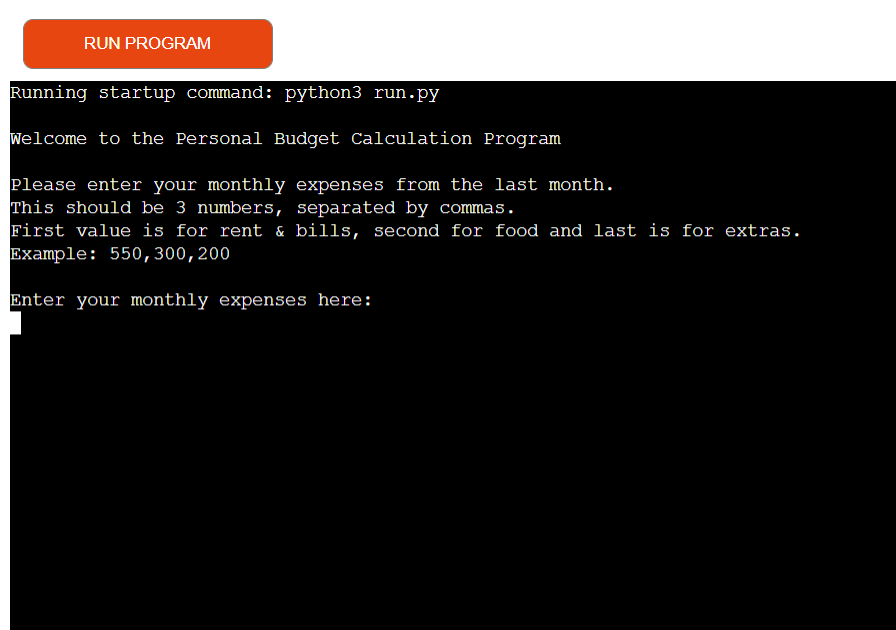

# Personal Budget Calculation Program
---
Developer : JKCC

[Go to the website](https://personal-budget-calculation.herokuapp.com/)

---

---
## Table of Contents
---
1. [Goals](#goals)
    * [Users Goals](#user-goals)
    * [Developer Goals](#site-owner-goals)
2. [User Experience](#user-experience)
    * [Target Crowd](#target-crowd)
    * [User Requirements and Expectation](#user-requirements-expectation)
    * [User Stories](#user-stories)
3. [Technical Design](#technical-design)
    * [Flow Chart](#flow-chart)
4. [Technologies Used](#technology)
    * [Languages](#languages)
    *[Frameworks and Tools](#frameworks)
5. [Features](#features)
    * [Get Monthly Expenses Data](#get-monthly-expenses)
    * [Check Values Entered](#check)
    * [Amend Worksheets](#amend)
    * [Calculate Loss or Savings](#loss-savings)
    * [Calculate and Adjust Budget for the Next Month](#budget)
6. [Validation](#validation)
    * [PEP8 Validation](#pep)
    * [User Stories Validation](#stories)
7. [Bugs](#bugs)
8. [Deployment](#deployment)
9. [Credits](#credits)
10. [Acknowledgement](#acknowledgement)

---
## Goals
