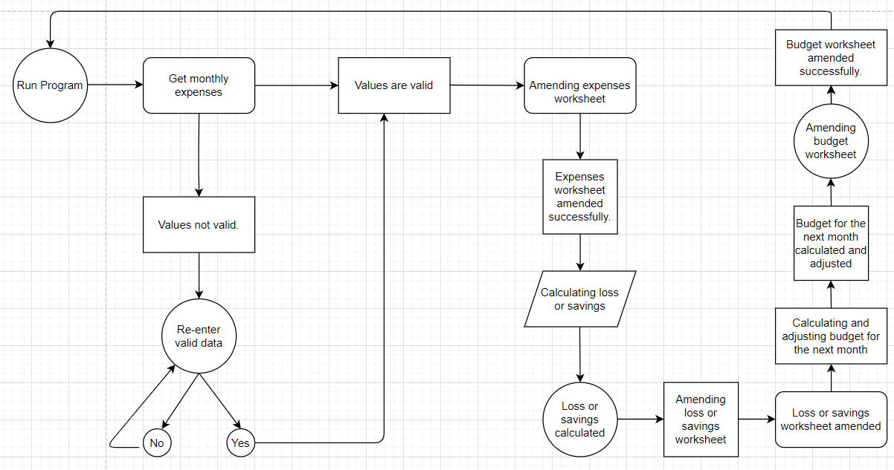
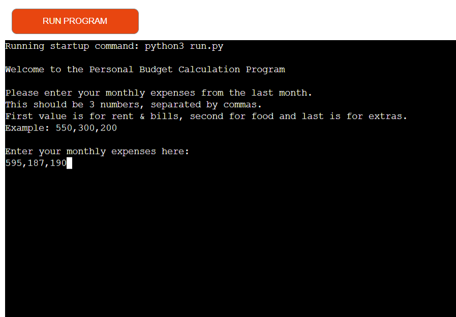
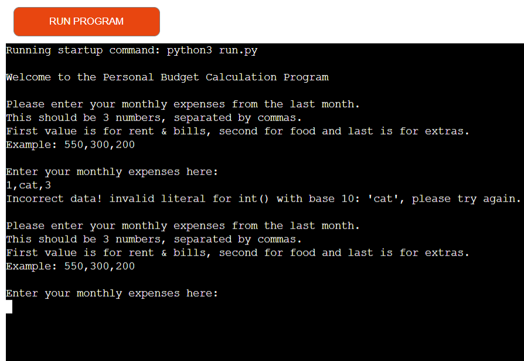
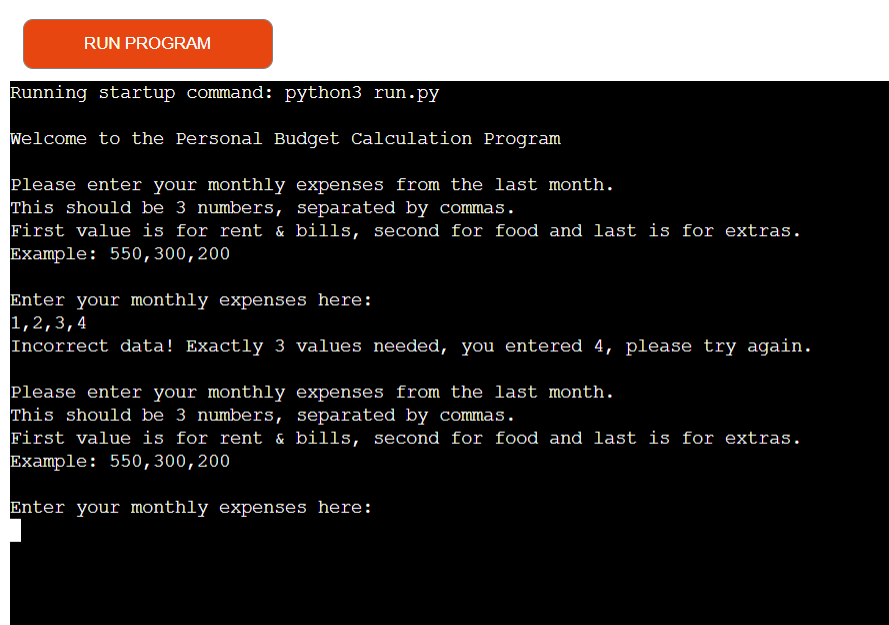
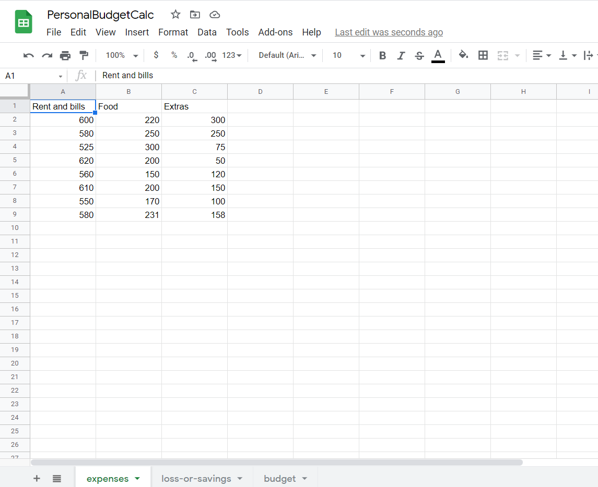
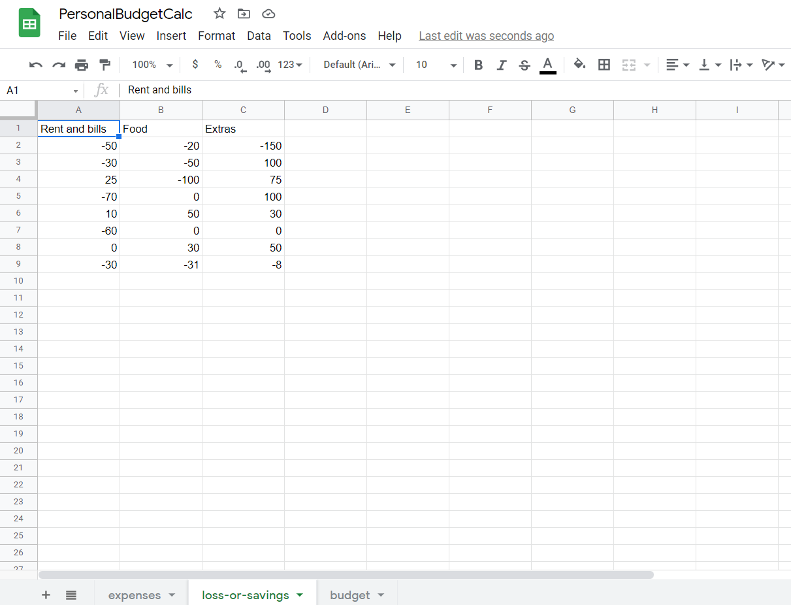
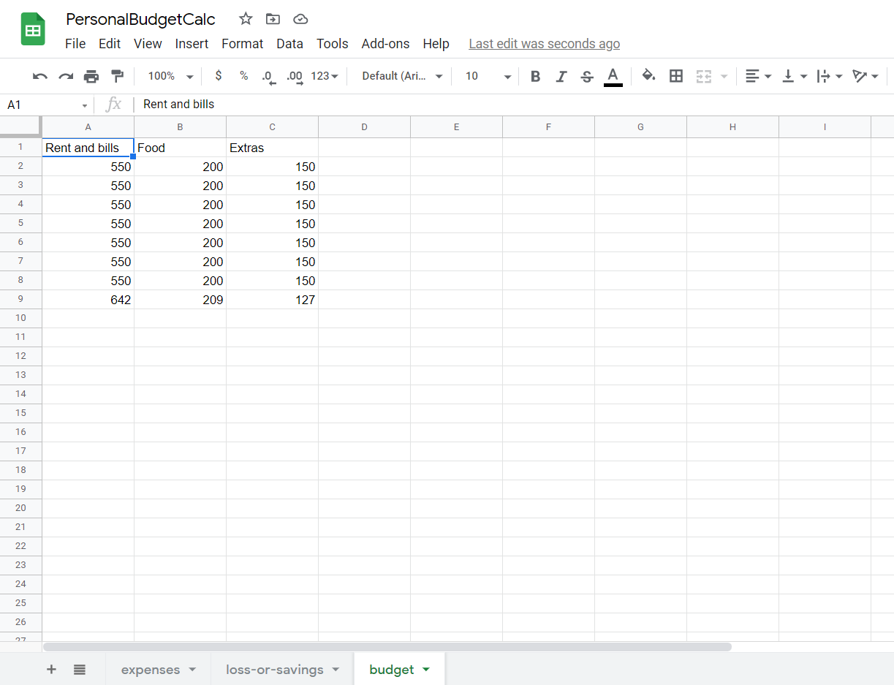
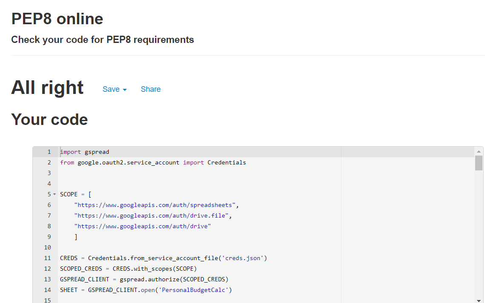
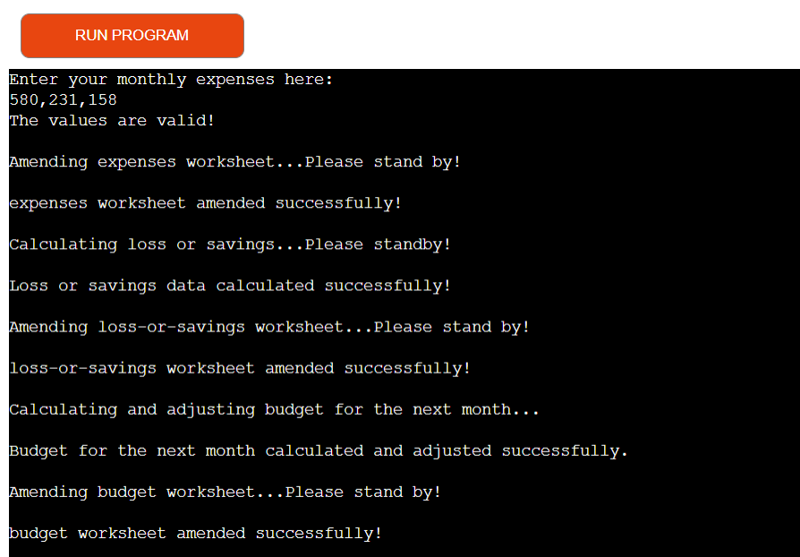

# Personal Budget Calculation Program
---
Developer : JKCC

[Go to the website](https://personal-budget-calculation.herokuapp.com/)

---

---
## Table of Contents
---
1. [Goals](#goals)
    * [Users Goals](#user-goals)
    * [Developer Goals](#owner-goals)
2. [User Experience](#user-experience)
    * [Target Crowd](#target-crowd)
    * [User Requirements and Expectation](#user-requirements-expectation)
    * [User Stories](#user-stories)
    * [Site Owner Story](#site-owner)
3. [Technical Design](#technical-design)
    * [Flow Chart](#flow-chart)
4. [Technologies Used](#technology)
    * [Languages](#languages)
    * [Frameworks and Tools](#frameworks)
5. [Features](#features)
    * [Get Monthly Expenses Data](#get-monthly)
    * [Check Values Entered](#check)
    * [Amend Worksheets](#amend)
    * [Calculate Loss or Savings](#loss-savings)
    * [Calculate and Adjust Budget for the Next Month](#budget)
6. [Validation](#validation)
    * [PEP8 Validation](#pep)
    * [User Stories Testing](#stories)
    * [Site Owner Story Testing](#owner)
7. [Bugs](#bugs)
8. [Deployment](#deployment)
9. [Credits](#credits)
10. [Acknowledgement](#acknowledgement)

---
## Goals
Personal Budget Calculation app is a program that helps people properly budget their expenses. People can also track their expenses as it is saved in a google sheet.  Futhermore, it can calculate loss or savings every month by deducting the expenses per month to your alloted budget for that month. Lastly, the app can adjust the budget where it is more needed for the next month depending on the expenditure over the last 5 months.

### User Goals
* To be able to monitor expenditures.
* To be able to get some help on how to budget their monthly allowance and help to adjust budget allocation where it is more needed.

### Developer Goals
* To help people allocate, monitor their expenses and adjust their budgets.

---

## User Experience

---
### Target Crowd
* Employees having trouble budgeting their income.
* Students that wants to monitor their expenses and allocate their allowance properly.

### User Requirements and Expectations
* Ability to input data.
* Easy to use
* Easy set up
* Google account for the spreadsheet, cloud platform
### User Stories
1. As a user, I want to easily know how to use the app.
2. As a user, I want to know what the app is doing and what the app had done.
3. As a user, I want to see where my data is going to be saved.
### Site Owner Story
1. As the site owner, I want the user to get feedbacks or prompts in case user entered an invalid data.

---
## Technical Design
* Flow Chart

---
## Technologies Used
### Languages
* Python

### Framework and Tools
* diagrams.net - To create the flow char
* Github
* Gitpod
* Google Spreadsheet
* Google Cloud Platform
* Heroku - where the app is deployed
---
## Features
### Get Monthly Expenses Data
* This feature let the user input their monthly expenses for rent/bills, food and extras. User story covered number 1.

### Check Values Entered
* This feature will give feedback to users if the data provided is invalid. Site owner story covered number 1. 

### Amend Worksheets
* This feature will automatically amend the user worksheets and save data when valid values are entered on the app. User story covered number 3.

### Calculate Loss or Savings
* This feature will automatically calculate loss or savings. This is attained by deducting users monthly expenses for rent/bills, food and extras to the users budget for that month. Positive result means the user did not use all the allocated budget for that month. On one hand, a negative result means that the user spent more than the allocated budget for that month. User story covered number 2.

### Calculate and Adjust Budget for the Next Month
* This feature will automatically calculate and adjust the users budget for the next month where budget is more needed depending on the users expenditures for the last 5 months. User story covered number 2.

---
## Validation
### PEP8 Validation
* PEP8 online was use to validate the python code written. Result came back with no warnings or errors.

### User Stories Testing
1. As a user, I want to easily know how to use the app.

The welcome page has instructions on how to use the app.

| Feature      | Action    | Result    |
| :------------- | :----------: | -----------: |
| Welcome page | When you opened the app, it shows intructions on how to use the app   | Worked    |

2. As a user, I want to know what the app is doing and what the app had done.

This screenshot tells/prompts the user on what the app is doing or the things that had been done.

| Feature      | Action    | Result    |
| :------------- | :----------: | -----------: |
| Get Monthly Expenses Data | When you entered a valid data, the app with automatically amend, calculate and adjust your budget. The screen prompts will appears saying the things the app is doing or the things that has been done.| Worked    |

3. As a user, I want to see where my data is going to be saved.

Data will be save directly to the user google account drive and spreadsheet

| Feature      | Action    | Result    |
| :------------- | :----------: | -----------: |
| Amend Worksheets | When the user entered a valid data, the app automatically amend the spreadsheet chosen and shared by the user to the app. | Worked    |

### Site Owner Story Testing
1. As the site owner, I want the user to get feedbacks or prompts in case user entered an invalid data.

| Feature      | Action    | Result    |
| :------------- | :----------: | -----------: |
| Check Value | When the user entered an invalid data, the app with give the user some feedbacks on what they have entered wrong and gives instructions to users on how to input valid data.   | Worked    |

---
## Bugs
* At present, no bugs were detected when using the app.

---
## Depolyment
### The website was deployed using Heroku by following these steps:

1. Use the "pip3 freeze > requirements.txt" command in the terminal to save any libraries that need to be installed in the file.
2. Login or create a Heroku account
3. Click the "new" button in the upper right corner and select "create new app".
4. Choose an app name and your region and click "Create app".
5. Go to the "settings" tab, add the python build pack and then the node.js build pack.
6. Go to the "deploy" tab and pick GitHub as a deployment method.
7. Search for a repository to connect to
8. Click enable automatic deploys and then deploy branch
9. Wait for the app to build and then click on the "View" link.

### You can fork the repository by following these steps:

1. Go to the GitHub repository.
2. Click on the Fork button in the upper right-hand corner.

### You can clone the repository by following these steps:

1. Go to the GitHub repository
2. Locate the Code button above the list of files and click it
3. Select if you prefer to clone using HTTPS, SSH, or Github CLI and click the copy button to copy the URL to your clipboard.
4. Open Git Bash
5. Change the current working directory to the one where you want the cloned directory.
6. Type git clone and paste the URL from the clipboard ($ git clone https://github.com/YOUR-USERNAME/YOUR-REPOSITORY)
7. Press Enter to create your local clone.

---
## Credits
* Making this app was inspired by the Love Sandwiches project provided by the Code institute.
### Code
* The codes were based and modified from the Love Sandwiches project of the Code institute.

---
## Acknoledgements
### I would like to take this opportunity to thank:
* Code institute for the tutorial on how python works.
* Google
* Lastly, I would like to thank JK, you know who you are. Thanks for the advice, for cheering me up when I'm stressed out and thank you for your belief in me that I can do this course and succeed.